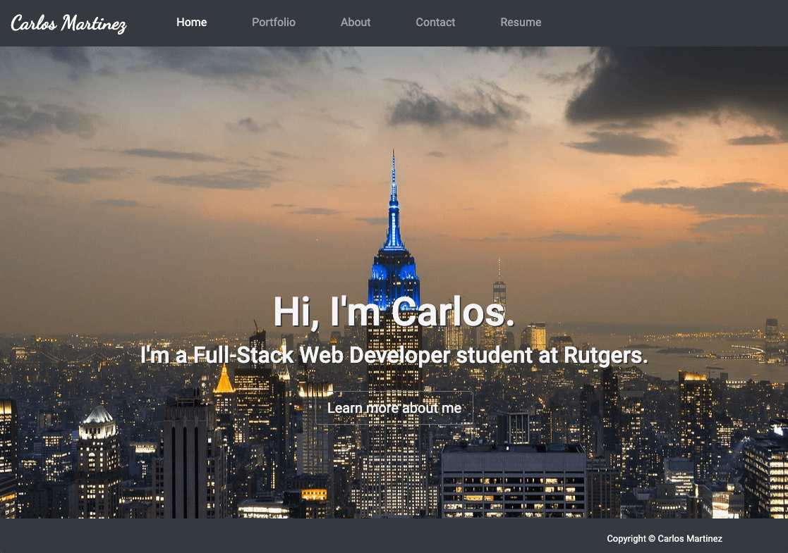
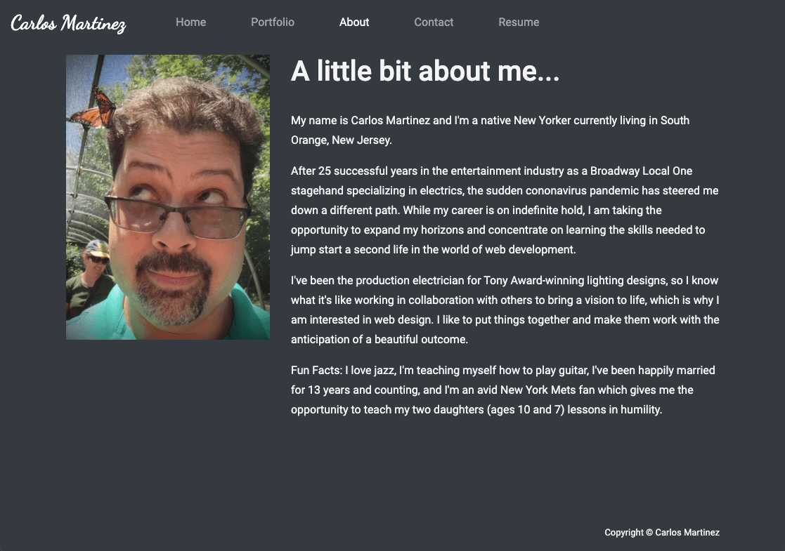
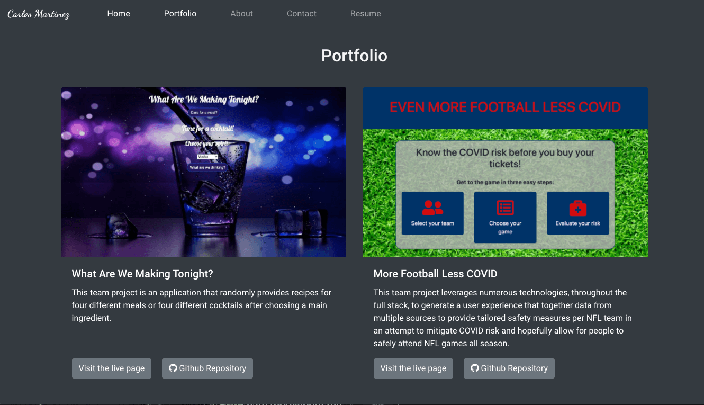
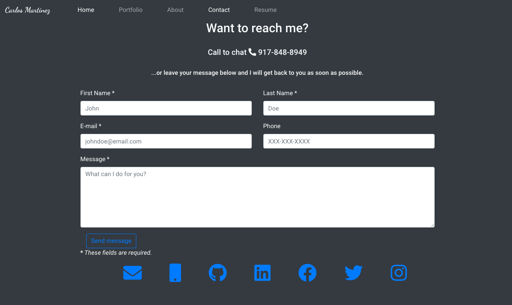
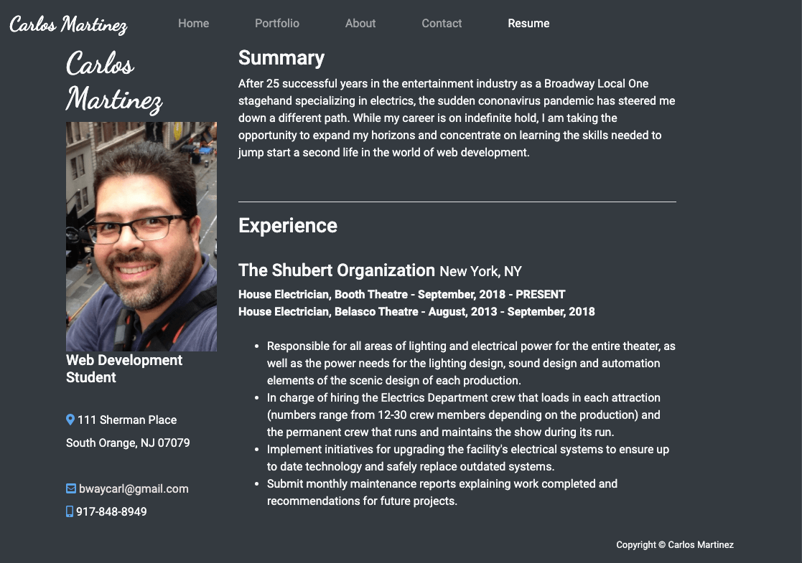

# Portfolio-React
## Unit 20
### RUT-JER-FSF-PT-06-2020-U-C
---
 

### Week 20 Update:

Rerender into a single page application using React.
### Week 8 Updates included:
- Pinned repositories to [Github Profile](https://github.com/BwayCarl).
- Updated [LinkedIn Profile](https://www.linkedin.com/in/carlos-martinez-8702b146/).
- Updated [Portfolio with Resume](https://bwaycarl.github.io/Portfolio/) and a link to a PDF download.
- Updated [Github Profile](https://github.com/BwayCarl) with contact info and some new follows of fellow students.

Original Assignment: to build a responsive portfolio using Bootstrap &amp; CSS.
#### Screenshots:

